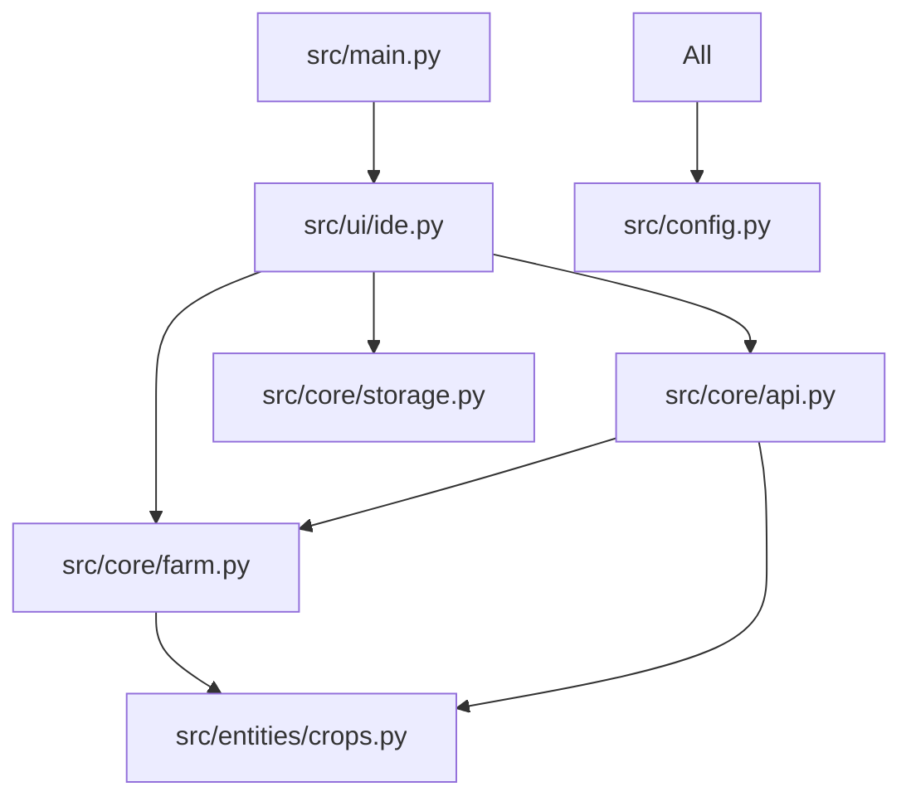

# 代码模块化拆分协议 (Code Modularization Protocol)

> [!NOTE]
> 本指令用于指导将单体文件项目拆分为符合工业标准的 Python 模块化结构。

## 1. 目标架构图 (Target Architecture)

## 2. 拆分准则
- **包管理 (Package Management)**：每个子文件夹必须包含 `__init__.py`，确保形成可导入的 Python Package。
- **解耦逻辑 (Decoupling)**：
  - `UI` 层严禁直接修改 `Model` 层数据，必须通过 `Controller/API` 或 `Core` 方法。
  - `Config` 应包含所有硬编码的硬参数（颜色、尺寸、平衡常数）。
- **导入规范 (Import Norms)**：
  - 优先使用绝对导入（e.g., `from src.core.farm import Farm`）。
  - 严禁循环引用（Circular Imports）。如果出现，需重新评估依赖树或使用延迟导入。

## 3. 执行指令
1.  **移位**：创建 `src` 并将原始逻辑平移入对应。
2.  **清理**：移除每个新模块中冗余的 `import` 语句。
3.  **入口封装**：`main.py` 应保持极简，仅负责初始化环境及启动 UI。
